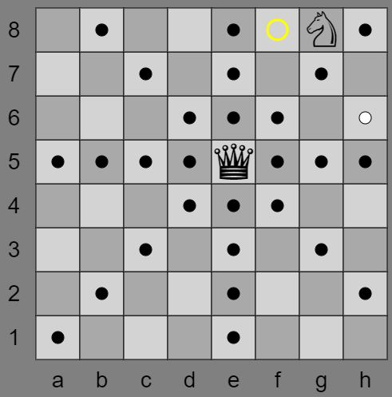

# Knight Moves

[Try it!](https://christernilsson.github.io/2023-008-KnightMoves/)

Spelet går ut på att med en springare besöka alla rutor på ett schackbräde.  
Dock måste man undvika att bli slagen av en dam.  

Man inleder med att ange var damen ska stå.  
Dam på raderna 1,3,5 och 7 markerar vilka rutor damen hotar  
Dam på kolumnerna a,c,e och g markerar rutor dit springaren kan flytta.  
Qa1 kräver 118 drag.
Qd5 kräver 158 drag.

Därefter klickar man på de rutor springaren ska gå till.  
En gul ring markerar vilken ruta man ska gå till.  

[Inspiration](https://www.funnyhowtheknightmoves.com/)

[Shortest Path](https://gist.github.com/hughdbrown/5c14ec41c30532807afaeba9c16789a8?permalink_comment_id=4451216#gistcomment-4451216)

[Github](https://github.com/jairtrejo/knight-moves)

[Hacker News](https://news.ycombinator.com/item?id=34460868)

[Lösningar](knight.txt) (ruta, antal steg, steg)
